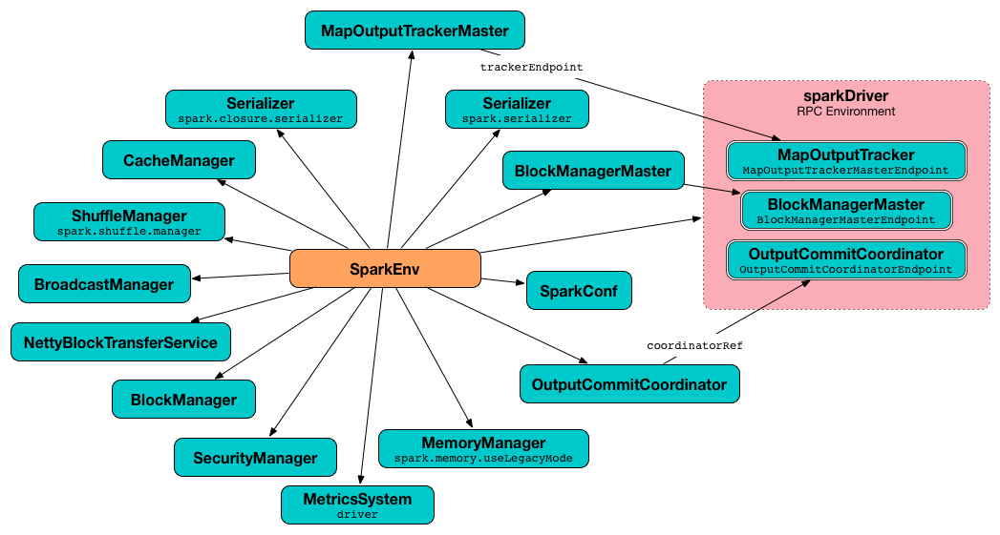
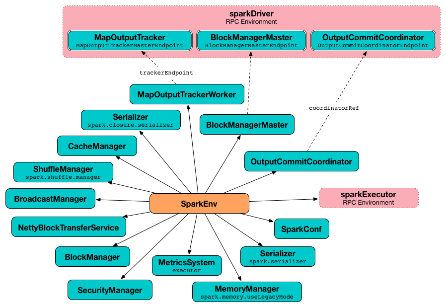

# SparkEnv

`SparkEnv` is a handle to **Spark Execution Environment** with the [core services](#services) of Apache Spark (that interact with each other to establish a distributed computing platform for a Spark application).

There are two separate `SparkEnv`s of the [driver](#createDriverEnv) and [executors](#createExecutorEnv).

## <span id="services"> Core Services

Property | Service
---------|----------
 <span id="blockManager"> blockManager | [BlockManager](storage/BlockManager.md)
 <span id="broadcastManager"> broadcastManager | [BroadcastManager](core/BroadcastManager.md)
 <span id="closureSerializer"> closureSerializer | [Serializer](serializer/Serializer.md)
 <span id="conf"> conf | [SparkConf](SparkConf.md)
 <span id="mapOutputTracker"> mapOutputTracker | [MapOutputTracker](scheduler/MapOutputTracker.md)
 <span id="memoryManager"> memoryManager | [MemoryManager](memory/MemoryManager.md)
 <span id="metricsSystem"> metricsSystem | [MetricsSystem](metrics/MetricsSystem.md)
 <span id="outputCommitCoordinator"> outputCommitCoordinator | [OutputCommitCoordinator](scheduler/OutputCommitCoordinator.md)
 <span id="rpcEnv"> rpcEnv | [RpcEnv](rpc/RpcEnv.md)
 <span id="securityManager"> securityManager | SecurityManager
 <span id="serializer"> serializer | [Serializer](serializer/Serializer.md)
 <span id="serializerManager"> serializerManager | [SerializerManager](serializer/SerializerManager.md)
 <span id="shuffleManager"> shuffleManager | [ShuffleManager](shuffle/ShuffleManager.md)

## Creating Instance

`SparkEnv` takes the following to be created:

* <span id="executorId"> Executor ID
* [RpcEnv](#rpcEnv)
* [Serializer](#serializer)
* [Serializer](#closureSerializer)
* [SerializerManager](#serializerManager)
* [MapOutputTracker](#mapOutputTracker)
* [ShuffleManager](#shuffleManager)
* [BroadcastManager](#broadcastManager)
* [BlockManager](#blockManager)
* [SecurityManager](#securityManager)
* [MetricsSystem](#metricsSystem)
* [MemoryManager](#memoryManager)
* [OutputCommitCoordinator](#outputCommitCoordinator)
* [SparkConf](#conf)

`SparkEnv` is created using [create](#create) utility.

## <span id="createDriverEnv"> Creating SparkEnv for Driver

```scala
createDriverEnv(
  conf: SparkConf,
  isLocal: Boolean,
  listenerBus: LiveListenerBus,
  numCores: Int,
  mockOutputCommitCoordinator: Option[OutputCommitCoordinator] = None): SparkEnv
```

`createDriverEnv` creates a SparkEnv execution environment for the driver.



`createDriverEnv` accepts an instance of ROOT:SparkConf.md[SparkConf], spark-deployment-environments.md[whether it runs in local mode or not], scheduler:LiveListenerBus.md[], the number of cores to use for execution in local mode or `0` otherwise, and a scheduler:OutputCommitCoordinator.md[OutputCommitCoordinator] (default: none).

`createDriverEnv` ensures that spark-driver.md#spark_driver_host[spark.driver.host] and spark-driver.md#spark_driver_port[spark.driver.port] settings are defined.

It then passes the call straight on to the <<create, create helper method>> (with `driver` executor id, `isDriver` enabled, and the input parameters).

`createDriverEnv` is used when `SparkContext` is [created](SparkContext.md#createSparkEnv).

## <span id="createExecutorEnv"> Creating SparkEnv for Executor

```scala
createExecutorEnv(
  conf: SparkConf,
  executorId: String,
  hostname: String,
  numCores: Int,
  ioEncryptionKey: Option[Array[Byte]],
  isLocal: Boolean): SparkEnv
createExecutorEnv(
  conf: SparkConf,
  executorId: String,
  bindAddress: String,
  hostname: String,
  numCores: Int,
  ioEncryptionKey: Option[Array[Byte]],
  isLocal: Boolean): SparkEnv
```

`createExecutorEnv` creates an **executor's (execution) environment** that is the Spark execution environment for an executor.



`createExecutorEnv` simply <<create, creates the base SparkEnv>> (passing in all the input parameters) and <<set, sets it as the current SparkEnv>>.

NOTE: The number of cores `numCores` is configured using `--cores` command-line option of `CoarseGrainedExecutorBackend` and is specific to a cluster manager.

`createExecutorEnv` is used when `CoarseGrainedExecutorBackend` utility is requested to `run`.

## <span id="create"> Creating "Base" SparkEnv (for Driver and Executors)

```scala
create(
  conf: SparkConf,
  executorId: String,
  bindAddress: String,
  advertiseAddress: String,
  port: Option[Int],
  isLocal: Boolean,
  numUsableCores: Int,
  ioEncryptionKey: Option[Array[Byte]],
  listenerBus: LiveListenerBus = null,
  mockOutputCommitCoordinator: Option[OutputCommitCoordinator] = None): SparkEnv
```

create is an utility to create the "base" SparkEnv (that is "enhanced" for the driver and executors later on).

.create's Input Arguments and Their Usage
[cols="1,2",options="header",width="100%"]
|===
| Input Argument
| Usage

| `bindAddress`
| Used to create rpc:index.md[RpcEnv] and storage:NettyBlockTransferService.md#creating-instance[NettyBlockTransferService].

| `advertiseAddress`
| Used to create rpc:index.md[RpcEnv] and storage:NettyBlockTransferService.md#creating-instance[NettyBlockTransferService].

| `numUsableCores`
| Used to create memory:MemoryManager.md[MemoryManager],
 storage:NettyBlockTransferService.md#creating-instance[NettyBlockTransferService] and storage:BlockManager.md#creating-instance[BlockManager].
|===

[[create-Serializer]]
create creates a `Serializer` (based on <<spark_serializer, spark.serializer>> setting). You should see the following `DEBUG` message in the logs:

```
Using serializer: [serializer]
```

[[create-closure-Serializer]]
create creates a closure `Serializer` (based on <<spark_closure_serializer, spark.closure.serializer>>).

[[ShuffleManager]][[create-ShuffleManager]]
create creates a shuffle:ShuffleManager.md[ShuffleManager] given the value of ROOT:configuration-properties.md#spark.shuffle.manager[spark.shuffle.manager] configuration property.

[[MemoryManager]][[create-MemoryManager]]
create creates a memory:MemoryManager.md[MemoryManager] based on ROOT:configuration-properties.md#spark.memory.useLegacyMode[spark.memory.useLegacyMode] setting (with memory:UnifiedMemoryManager.md[UnifiedMemoryManager] being the default and `numCores` the input `numUsableCores`).

[[NettyBlockTransferService]][[create-NettyBlockTransferService]]
create creates a storage:NettyBlockTransferService.md#creating-instance[NettyBlockTransferService] with the following ports:

* spark-driver.md#spark_driver_blockManager_port[spark.driver.blockManager.port] for the driver (default: `0`)

* storage:BlockManager.md#spark_blockManager_port[spark.blockManager.port] for an executor (default: `0`)

NOTE: create uses the `NettyBlockTransferService` to <<create-BlockManager, create a BlockManager>>.

CAUTION: FIXME A picture with SparkEnv, `NettyBlockTransferService` and the ports "armed".

[[BlockManagerMaster]][[create-BlockManagerMaster]]
create creates a storage:BlockManagerMaster.md#creating-instance[BlockManagerMaster] object with the `BlockManagerMaster` RPC endpoint reference (by <<registerOrLookupEndpoint, registering or looking it up by name>> and storage:BlockManagerMasterEndpoint.md[]), the input ROOT:SparkConf.md[SparkConf], and the input `isDriver` flag.

.Creating BlockManager for the Driver
image::sparkenv-driver-blockmanager.png[align="center"]

NOTE: create registers the *BlockManagerMaster* RPC endpoint for the driver and looks it up for executors.

.Creating BlockManager for Executor
image::sparkenv-executor-blockmanager.png[align="center"]

[[BlockManager]][[create-BlockManager]]
create creates a storage:BlockManager.md#creating-instance[BlockManager] (using the above <<BlockManagerMaster, BlockManagerMaster>>, <<create-NettyBlockTransferService, NettyBlockTransferService>> and other services).

create creates a core:BroadcastManager.md[].

[[MapOutputTracker]][[create-MapOutputTracker]]
create creates a scheduler:MapOutputTrackerMaster.md[MapOutputTrackerMaster] or scheduler:MapOutputTrackerWorker.md[MapOutputTrackerWorker] for the driver and executors, respectively.

NOTE: The choice of the real implementation of scheduler:MapOutputTracker.md[MapOutputTracker] is based on whether the input `executorId` is *driver* or not.

[[MapOutputTrackerMasterEndpoint]][[create-MapOutputTrackerMasterEndpoint]]
create <<registerOrLookupEndpoint, registers or looks up `RpcEndpoint`>> as *MapOutputTracker*. It registers scheduler:MapOutputTrackerMasterEndpoint.md[MapOutputTrackerMasterEndpoint] on the driver and creates a RPC endpoint reference on executors. The RPC endpoint reference gets assigned as the scheduler:MapOutputTracker.md#trackerEndpoint[MapOutputTracker RPC endpoint].

CAUTION: FIXME

[[create-CacheManager]]
It creates a CacheManager.

[[create-MetricsSystem]]
It creates a MetricsSystem for a driver and a worker separately.

It initializes `userFiles` temporary directory used for downloading dependencies for a driver while this is the executor's current working directory for an executor.

[[create-OutputCommitCoordinator]]
An OutputCommitCoordinator is created.

### Usage

`create` is used when `SparkEnv` utility is used to create a `SparkEnv` for the [driver](#createDriverEnv) and [executors](#createExecutorEnv).

== [[get]] Accessing SparkEnv

[source, scala]
----
get: SparkEnv
----

get returns the SparkEnv on the driver and executors.

[source, scala]
----
import org.apache.spark.SparkEnv
assert(SparkEnv.get.isInstanceOf[SparkEnv])
----

== [[registerOrLookupEndpoint]] Registering or Looking up RPC Endpoint by Name

[source, scala]
----
registerOrLookupEndpoint(
  name: String,
  endpointCreator: => RpcEndpoint)
----

`registerOrLookupEndpoint` registers or looks up a RPC endpoint by `name`.

If called from the driver, you should see the following INFO message in the logs:

```
Registering [name]
```

And the RPC endpoint is registered in the RPC environment.

Otherwise, it obtains a RPC endpoint reference by `name`.

== [[stop]] Stopping SparkEnv

[source, scala]
----
stop(): Unit
----

stop checks <<isStopped, isStopped>> internal flag and does nothing when enabled already.

Otherwise, stop turns `isStopped` flag on, stops all `pythonWorkers` and requests the following services to stop:

1. scheduler:MapOutputTracker.md#stop[MapOutputTracker]
2. shuffle:ShuffleManager.md#stop[ShuffleManager]
3. core:BroadcastManager.md#stop[BroadcastManager]
4. storage:BlockManager.md#stop[BlockManager]
5. storage:BlockManagerMaster.md#stop[BlockManagerMaster]
6. spark-metrics-MetricsSystem.md#stop[MetricsSystem]
7. scheduler:OutputCommitCoordinator.md#stop[OutputCommitCoordinator]

stop rpc:index.md#shutdown[requests `RpcEnv` to shut down] and rpc:index.md#awaitTermination[waits till it terminates].

Only on the driver, stop deletes the <<driverTmpDir, temporary directory>>. You can see the following WARN message in the logs if the deletion fails.

```
Exception while deleting Spark temp dir: [path]
```

NOTE: stop is used when ROOT:SparkContext.md#stop[`SparkContext` stops] (on the driver) and executor:Executor.md#stop[`Executor` stops].

== [[set]] `set` Method

[source, scala]
----
set(e: SparkEnv): Unit
----

`set` saves the input SparkEnv to <<env, env>> internal registry (as the default SparkEnv).

NOTE: `set` is used when...FIXME

== [[environmentDetails]] environmentDetails Utility

[source, scala]
----
environmentDetails(
  conf: SparkConf,
  schedulingMode: String,
  addedJars: Seq[String],
  addedFiles: Seq[String]): Map[String, Seq[(String, String)]]
----

environmentDetails...FIXME

environmentDetails is used when SparkContext is requested to ROOT:SparkContext.md#postEnvironmentUpdate[post a SparkListenerEnvironmentUpdate event].

== [[logging]] Logging

Enable `ALL` logging level for `org.apache.spark.SparkEnv` logger to see what happens inside.

Add the following line to `conf/log4j.properties`:

[source]
----
log4j.logger.org.apache.spark.SparkEnv=ALL
----

Refer to ROOT:spark-logging.md[Logging].

== [[internal-properties]] Internal Properties

[cols="30m,70",options="header",width="100%"]
|===
| Name
| Description

| isStopped
| [[isStopped]] Used to mark SparkEnv stopped

Default: `false`

| driverTmpDir
| [[driverTmpDir]]

|===
