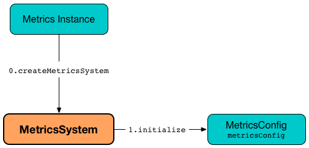

# MetricsSystem

`MetricsSystem` is a [registry](#registry) of metrics [sources](#sources) and [sinks](#sinks) of a [Spark subsystem](index.md#metrics-systems).

## Creating Instance

`MetricsSystem` takes the following to be created:

* <span id="instance"> Instance Name
* <span id="conf"> [SparkConf](../SparkConf.md)
* <span id="securityMgr"> `SecurityManager`

While being created, `MetricsSystem` requests the [MetricsConfig](#metricsConfig) to [initialize](MetricsConfig.md#initialize).



`MetricsSystem` is created (using [createMetricsSystem](#createMetricsSystem) utility) for the [Metrics Systems](index.md#metrics-systems).

## <span id="createMetricsSystem"> Creating MetricsSystem

```scala
createMetricsSystem(
  instance: String
  conf: SparkConf
  securityMgr: SecurityManager): MetricsSystem
```

`createMetricsSystem` creates a new `MetricsSystem` (for the given parameters).

`createMetricsSystem` is used to create [metrics systems](index.md#metrics-systems).

## <span id="StaticSources"><span id="allSources"> Metrics Sources for Spark SQL

* `CodegenMetrics`
* `HiveCatalogMetrics`

## <span id="registerSource"> Registering Metrics Source

```scala
registerSource(
  source: Source): Unit
```

`registerSource` adds `source` to the [sources](#sources) internal registry.

`registerSource` [creates an identifier](#buildRegistryName) for the metrics source and registers it with the [MetricRegistry](#registry).

`registerSource` uses Metrics' [MetricRegistry.register](http://metrics.dropwizard.io/3.1.0/apidocs/com/codahale/metrics/MetricRegistry.html#register-java.lang.String-T-) to register a metrics source under a given name.

`registerSource` prints out the following INFO message to the logs when registering a name more than once:

```text
Metrics already registered
```

## <span id="buildRegistryName"> Building Metrics Source Identifier

```scala
buildRegistryName(
  source: Source): String
```

`buildRegistryName` uses spark-metrics-properties.md#spark.metrics.namespace[spark.metrics.namespace] and executor:Executor.md#spark.executor.id[spark.executor.id] Spark properties to differentiate between a Spark application's driver and executors, and the other Spark framework's components.

(only when <<instance, instance>> is `driver` or `executor`) `buildRegistryName` builds metrics source name that is made up of spark-metrics-properties.md#spark.metrics.namespace[spark.metrics.namespace], executor:Executor.md#spark.executor.id[spark.executor.id] and the name of the `source`.

!!! note
    `buildRegistryName` uses Dropwizard Metrics' [MetricRegistry](https://metrics.dropwizard.io/3.1.0/apidocs/com/codahale/metrics/MetricRegistry.html) to build metrics source identifiers.

FIXME Finish for the other components.

`buildRegistryName` is used when `MetricsSystem` is requested to [register](#registerSource) or [remove](#removeSource) a metrics source.

## <span id="registerSources"> Registering Metrics Sources for Spark Instance

```scala
registerSources(): Unit
```

`registerSources` finds <<metricsConfig, metricsConfig>> configuration for the <<instance, metrics instance>>.

NOTE: `instance` is defined when MetricsSystem <<creating-instance, is created>>.

`registerSources` finds the configuration of all the spark-metrics-Source.md[metrics sources] for the subsystem (as described with `source.` prefix).

For every metrics source, `registerSources` finds `class` property, creates an instance, and in the end <<registerSource, registers it>>.

When `registerSources` fails, you should see the following ERROR message in the logs followed by the exception.

```text
Source class [classPath] cannot be instantiated
```

`registerSources` is used when `MetricsSystem` is requested to [start](#start).

## <span id="getServletHandlers"> Requesting JSON Servlet Handler

```scala
getServletHandlers: Array[ServletContextHandler]
```

If the MetricsSystem is <<running, running>> and the <<metricsServlet, MetricsServlet>> is defined for the metrics system, `getServletHandlers` simply requests the <<metricsServlet, MetricsServlet>> for the spark-metrics-MetricsServlet.md#getHandlers[JSON servlet handler].

When MetricsSystem is not <<running, running>> `getServletHandlers` throws an `IllegalArgumentException`.

```text
Can only call getServletHandlers on a running MetricsSystem
```

`getServletHandlers` is used when:

* `SparkContext` is [created](../spark-SparkContext-creating-instance-internals.md#MetricsSystem-getServletHandlers)
* (Spark Standalone) `Master` and `Worker` are requested to start

## <span id="registerSinks"> Registering Metrics Sinks

```scala
registerSinks(): Unit
```

`registerSinks` requests the <<metricsConfig, MetricsConfig>> for the spark-metrics-MetricsConfig.md#getInstance[configuration] of the <<instance, instance>>.

`registerSinks` requests the <<metricsConfig, MetricsConfig>> for the spark-metrics-MetricsConfig.md#subProperties[configuration] of all metrics sinks (i.e. configuration entries that match `^sink\\.(.+)\\.(.+)` regular expression).

For every metrics sink configuration, `registerSinks` takes `class` property and (if defined) creates an instance of the metric sink using an constructor that takes the configuration, <<registry, MetricRegistry>> and <<securityMgr, SecurityManager>>.

For a single *servlet* metrics sink, `registerSinks` converts the sink to a spark-metrics-MetricsServlet.md[MetricsServlet] and sets the <<metricsServlet, metricsServlet>> internal registry.

For all other metrics sinks, `registerSinks` adds the sink to the <<sinks, sinks>> internal registry.

In case of an `Exception`, `registerSinks` prints out the following ERROR message to the logs:

```text
Sink class [classPath] cannot be instantiated
```

`registerSinks` is used when `MetricsSystem` is requested to [start](#start).

## <span id="stop"> Stopping

```scala
stop(): Unit
```

`stop`...FIXME

## <span id="report"> Reporting Metrics

```scala
report(): Unit
```

`report` simply requests the registered [metrics sinks](#sinks) to [report metrics](Sink.md#report).

## <span id="start"> Starting

```scala
start(): Unit
```

`start` turns <<running, running>> flag on.

NOTE: `start` can only be called once and <<start-IllegalArgumentException, throws>> an `IllegalArgumentException` when called multiple times.

`start` <<registerSource, registers>> the <<StaticSources, "static" metrics sources>> for Spark SQL, i.e. `CodegenMetrics` and `HiveCatalogMetrics`.

`start` then registers the configured metrics <<registerSources, sources>> and <<registerSinks, sinks>> for the <<instance, Spark instance>>.

In the end, `start` requests the registered <<sinks, metrics sinks>> to spark-metrics-Sink.md#start[start].

[[start-IllegalArgumentException]]
`start` throws an `IllegalArgumentException` when <<running, running>> flag is on.

```text
requirement failed: Attempting to start a MetricsSystem that is already running
```

## Logging

Enable `ALL` logging level for `org.apache.spark.metrics.MetricsSystem` logger to see what happens inside.

Add the following line to `conf/log4j.properties`:

```text
log4j.logger.org.apache.spark.metrics.MetricsSystem=ALL
```

Refer to [Logging](../spark-logging.md).

## Internal Registries

### <span id="registry"> MetricRegistry

Integration point to Dropwizard Metrics' [MetricRegistry](https://metrics.dropwizard.io/3.1.0/apidocs/com/codahale/metrics/MetricRegistry.html)

Used when MetricsSystem is requested to:

* [Register](#registerSource) or [remove](#removeSource) a metrics source
* [Start](#start) (that in turn [registers metrics sinks](#registerSinks))

### <span id="metricsConfig"> MetricsConfig

[MetricsConfig](MetricsConfig.md)

Initialized when MetricsSystem is <<creating-instance, created>>.

Used when MetricsSystem registers <<registerSinks, sinks>> and <<registerSources, sources>>.

### <span id="metricsServlet"> MetricsServlet

[MetricsServlet JSON metrics sink](MetricsServlet.md) that is only available for the <<metrics-instances, metrics instances>> with a web UI (i.e. the driver of a Spark application and Spark Standalone's `Master`).

`MetricsSystem` may have at most one `MetricsServlet` JSON metrics sink (which is [registered by default](MetricsConfig.md#setDefaultProperties)).

Initialized when MetricsSystem registers <<registerSinks, sinks>> (and finds a configuration entry with `servlet` sink name).

Used when MetricsSystem is requested for a <<getServletHandlers, JSON servlet handler>>.

### <span id="running"> running Flag

Indicates whether `MetricsSystem` has been [started](#start) (`true`) or not (`false`)

Default: `false`

### <span id="sinks"> sinks

[Metrics sinks](Sink.md)

Used when MetricsSystem <<registerSinks, registers a new metrics sink>> and <<start, starts them eventually>>.

### <span id="sources"> sources

[Metrics sources](Source.md)

Used when MetricsSystem <<registerSource, registers a new metrics source>>.
