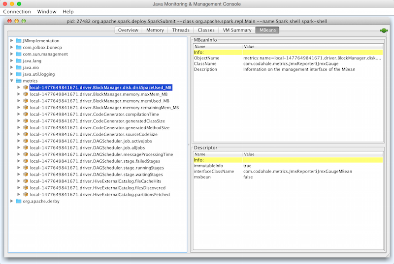

# Spark Metrics

**Spark Metrics** gives you execution metrics of [Spark subsystems](MetricsSystem.md#subsystems) (_metrics instances_), e.g. the driver of a Spark application or the master of a Spark Standalone cluster.

Spark Metrics uses [Dropwizard Metrics 3.1.0](http://metrics.dropwizard.io/3.1.0/) Java library for the metrics infrastructure.

> **Metrics** is a Java library which gives you unparalleled insight into what your code does in production.
>
> **Metrics** provides a powerful toolkit of ways to measure the behavior of critical components *in your production environment*.

## <span id="MetricsSystem"> MetricsSystem

Spark Metrics uses [MetricsSystem](MetricsSystem.md).

`MetricsSystem` uses Dropwizard Metrics' link:spark-metrics-MetricsSystem.adoc#registry[MetricRegistry] that acts as the integration point between Spark and the metrics library.

A Spark subsystem can access the `MetricsSystem` through the [SparkEnv.metricsSystem](../SparkEnv.adoc#metricsSystem) property.

```text
val metricsSystem = SparkEnv.get.metricsSystem
```

## <span id="MetricsConfig"> MetricsConfig

`MetricsConfig` is the configuration of the link:spark-metrics-MetricsSystem.adoc[MetricsSystem] (i.e. metrics link:spark-metrics-Source.adoc[sources] and link:spark-metrics-Sink.adoc[sinks]).

*metrics.properties* is the default metrics configuration file. It is configured using link:spark-metrics-properties.adoc#spark.metrics.conf[spark.metrics.conf] configuration property. The file is first loaded from the path directly before using Spark's CLASSPATH.

`MetricsConfig` also accepts a metrics configuration using ``spark.metrics.conf.``-prefixed configuration properties.

Spark comes with `conf/metrics.properties.template` file that is a template of metrics configuration.

## <span id="MetricsServlet"> MetricsServlet Metrics Sink

Among the metrics sinks is link:spark-metrics-MetricsServlet.adoc[MetricsServlet] that is used when *sink.servlet* metrics sink is configured in link:spark-metrics-MetricsConfig.adoc[metrics configuration].

CAUTION: FIXME Describe configuration files and properties

## <span id="JmxSink"> JmxSink Metrics Sink

Enable `org.apache.spark.metrics.sink.JmxSink` in link:spark-metrics-MetricsConfig.adoc[metrics configuration].

You can then use `jconsole` to access Spark metrics through JMX.

```text
*.sink.jmx.class=org.apache.spark.metrics.sink.JmxSink
```



## JSON URI Path

Metrics System is available at http://localhost:4040/metrics/json (for the default setup of a Spark application).

```text
$ http --follow http://localhost:4040/metrics/json
HTTP/1.1 200 OK
Cache-Control: no-cache, no-store, must-revalidate
Content-Length: 2200
Content-Type: text/json;charset=utf-8
Date: Sat, 25 Feb 2017 14:14:16 GMT
Server: Jetty(9.2.z-SNAPSHOT)
X-Frame-Options: SAMEORIGIN

{
    "counters": {
        "app-20170225151406-0000.driver.HiveExternalCatalog.fileCacheHits": {
            "count": 0
        },
        "app-20170225151406-0000.driver.HiveExternalCatalog.filesDiscovered": {
            "count": 0
        },
        "app-20170225151406-0000.driver.HiveExternalCatalog.hiveClientCalls": {
            "count": 2
        },
        "app-20170225151406-0000.driver.HiveExternalCatalog.parallelListingJobCount": {
            "count": 0
        },
        "app-20170225151406-0000.driver.HiveExternalCatalog.partitionsFetched": {
            "count": 0
        }
    },
    "gauges": {
    ...
    "timers": {
        "app-20170225151406-0000.driver.DAGScheduler.messageProcessingTime": {
            "count": 0,
            "duration_units": "milliseconds",
            "m15_rate": 0.0,
            "m1_rate": 0.0,
            "m5_rate": 0.0,
            "max": 0.0,
            "mean": 0.0,
            "mean_rate": 0.0,
            "min": 0.0,
            "p50": 0.0,
            "p75": 0.0,
            "p95": 0.0,
            "p98": 0.0,
            "p99": 0.0,
            "p999": 0.0,
            "rate_units": "calls/second",
            "stddev": 0.0
        }
    },
    "version": "3.0.0"
}
```

NOTE: You can access a Spark subsystem's `MetricsSystem` using its corresponding "leading" port, e.g. `4040` for the `driver`, `8080` for Spark Standalone's `master` and `applications`.

NOTE: You have to use the trailing slash (`/`) to have the output.

## Spark Standalone Master

```text
$ http http://192.168.1.4:8080/metrics/master/json/path
HTTP/1.1 200 OK
Cache-Control: no-cache, no-store, must-revalidate
Content-Length: 207
Content-Type: text/json;charset=UTF-8
Server: Jetty(8.y.z-SNAPSHOT)
X-Frame-Options: SAMEORIGIN

{
    "counters": {},
    "gauges": {
        "master.aliveWorkers": {
            "value": 0
        },
        "master.apps": {
            "value": 0
        },
        "master.waitingApps": {
            "value": 0
        },
        "master.workers": {
            "value": 0
        }
    },
    "histograms": {},
    "meters": {},
    "timers": {},
    "version": "3.0.0"
}
```
