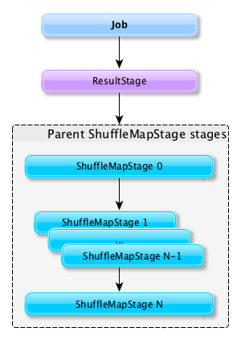
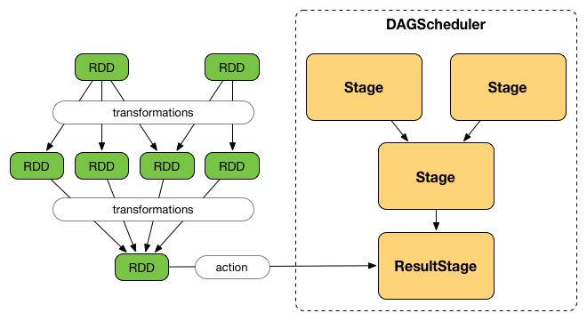
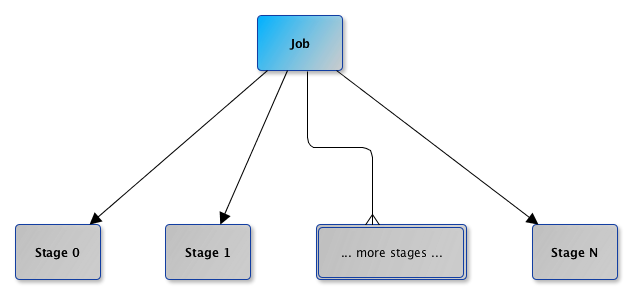

# Stage

`Stage` is a physical unit of execution. It is a step in a physical execution plan.

A stage is a set of parallel tasks -- one task per partition (of an RDD that computes partial results of a function executed as part of a Spark job).


In other words, a Spark job is a computation with that computation sliced into stages.

A stage is uniquely identified by `id`. When a stage is created, scheduler:DAGScheduler.md[DAGScheduler] increments internal counter `nextStageId` to track the number of scheduler:DAGScheduler.md#submitStage[stage submissions].

[[rdd]]
A stage can only work on the partitions of a single RDD (identified by `rdd`), but can be associated with many other dependent parent stages (via internal field `parents`), with the boundary of a stage marked by shuffle dependencies.

Submitting a stage can therefore trigger execution of a series of dependent parent stages (refer to scheduler:DAGScheduler.md#runJob[RDDs, Job Execution, Stages, and Partitions]).


Finally, every stage has a `firstJobId` that is the id of the job that submitted the stage.

There are two types of stages:

* scheduler:ShuffleMapStage.md[ShuffleMapStage] is an intermediate stage (in the execution DAG) that produces data for other stage(s). It writes *map output files* for a shuffle. It can also be the final stage in a job in scheduler:DAGScheduler.md#adaptive-query-planning[Adaptive Query Planning / Adaptive Scheduling].
* scheduler:ResultStage.md[ResultStage] is the final stage that executes rdd:index.md#actions[a Spark action] in a user program by running a function on an RDD.

When a job is submitted, a new stage is created with the parent scheduler:ShuffleMapStage.md[ShuffleMapStage] linked -- they can be created from scratch or linked to, i.e. shared, if other jobs use them already.



A stage tracks the jobs (their ids) it belongs to (using the internal `jobIds` registry).

DAGScheduler splits up a job into a collection of stages. Each stage contains a sequence of rdd:index.md[narrow transformations] that can be completed without rdd:spark-rdd-shuffle.md[shuffling] the entire data set, separated at *shuffle boundaries*, i.e. where shuffle occurs. Stages are thus a result of breaking the RDD graph at shuffle boundaries.



Shuffle boundaries introduce a barrier where stages/tasks must wait for the previous stage to finish before they fetch map outputs.



RDD operations with rdd:index.md[narrow dependencies], like `map()` and `filter()`, are pipelined together into one set of tasks in each stage, but operations with shuffle dependencies require multiple stages, i.e. one to write a set of map output files, and another to read those files after a barrier.

In the end, every stage will have only shuffle dependencies on other stages, and may compute multiple operations inside it. The actual pipelining of these operations happens in the `RDD.compute()` functions of various RDDs, e.g. `MappedRDD`, `FilteredRDD`, etc.

At some point of time in a stage's life, every partition of the stage gets transformed into a task - scheduler:ShuffleMapTask.md[ShuffleMapTask] or scheduler:ResultTask.md[ResultTask] for scheduler:ShuffleMapStage.md[ShuffleMapStage] and scheduler:ResultStage.md[ResultStage], respectively.

Partitions are computed in jobs, and result stages may not always need to compute all partitions in their target RDD, e.g. for actions like `first()` and `lookup()`.

`DAGScheduler` prints the following INFO message when there are tasks to submit:

```
Submitting 1 missing tasks from ResultStage 36 (ShuffledRDD[86] at reduceByKey at <console>:24)
```

There is also the following DEBUG message with pending partitions:

```
New pending partitions: Set(0)
```

Tasks are later submitted to scheduler:TaskScheduler.md[Task Scheduler] (via `taskScheduler.submitTasks`).

When no tasks in a stage can be submitted, the following DEBUG message shows in the logs:

```
FIXME
```

== [[findMissingPartitions]] Finding Missing Partitions

[source, scala]
----
findMissingPartitions(): Seq[Int]
----

findMissingPartitions gives the partition ids that are missing and need to be computed.

findMissingPartitions is used when DAGScheduler is requested to scheduler:DAGScheduler.md#submitMissingTasks[submitMissingTasks] and scheduler:DAGScheduler.md#handleTaskCompletion[handleTaskCompletion].

== [[failedOnFetchAndShouldAbort]] `failedOnFetchAndShouldAbort` Method

`Stage.failedOnFetchAndShouldAbort(stageAttemptId: Int): Boolean` checks whether the number of fetch failed attempts (using `fetchFailedAttemptIds`) exceeds the number of consecutive failures allowed for a given stage (that should then be aborted)

NOTE: The number of consecutive failures for a stage is not configurable.

== [[latestInfo]] Getting StageInfo For Most Recent Attempt

[source, scala]
----
latestInfo: StageInfo
----

`latestInfo` simply returns the <<_latestInfo, most recent `StageInfo`>> (i.e. makes it accessible).

== [[makeNewStageAttempt]] Creating New Stage Attempt

[source, scala]
----
makeNewStageAttempt(
  numPartitionsToCompute: Int,
  taskLocalityPreferences: Seq[Seq[TaskLocation]] = Seq.empty): Unit
----

makeNewStageAttempt executor:TaskMetrics.md[creates a new `TaskMetrics`] and executor:TaskMetrics.md#register[registers the internal accumulators (using the RDD's `SparkContext`)].

NOTE: makeNewStageAttempt uses <<rdd, rdd>> that was defined when <<creating-instance, `Stage` was created>>.

makeNewStageAttempt sets <<_latestInfo, _latestInfo>> to be a scheduler:spark-scheduler-StageInfo.md#fromStage[`StageInfo` from the current stage] (with <<nextAttemptId, nextAttemptId>>, `numPartitionsToCompute`, and `taskLocalityPreferences`).

makeNewStageAttempt increments <<nextAttemptId, nextAttemptId>> counter.

makeNewStageAttempt is used when `DAGScheduler` is requested to scheduler:DAGScheduler.md#submitMissingTasks[submit the missing tasks of a stage].

== [[internal-properties]] Internal Properties

[cols="30m,70",options="header",width="100%"]
|===
| Name
| Description

| [[details]] `details`
| Long description of the stage

Used when...FIXME

| [[fetchFailedAttemptIds]] `fetchFailedAttemptIds`
| FIXME

Used when...FIXME

| [[jobIds]] `jobIds`
| Set of spark-scheduler-ActiveJob.md[jobs] the stage belongs to.

Used when...FIXME

| [[name]] `name`
| Name of the stage

Used when...FIXME

| [[nextAttemptId]] `nextAttemptId`
| The ID for the next attempt of the stage.

Used when...FIXME

| [[numPartitions]] `numPartitions`
| Number of partitions

Used when...FIXME

| [[pendingPartitions]] `pendingPartitions`
| Set of pending spark-rdd-partitions.md[partitions]

Used when...FIXME

| [[_latestInfo]] `_latestInfo`
| Internal cache with...FIXME

Used when...FIXME
|===
